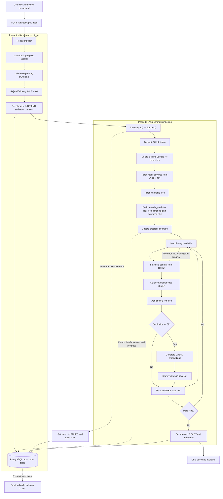

# CodeNavigation

CodeNavigation is an AI-powered codebase assistant. It connects to GitHub, indexes the source files in a selected repository, and lets you ask questions about the code with answers grounded in retrieved code context and file citations.

## Features

- GitHub OAuth login
- GitHub repository synchronization
- Asynchronous repository indexing
- PostgreSQL with pgvector for semantic code search
- OpenAI embeddings and chat completions through Spring AI
- Streaming chat responses over Server-Sent Events (SSE)
- File and line citations in assistant responses

## Architecture

```text
Next.js client
	|
	| HTTP, cookies, and SSE
	v
Spring Boot API
	|-- GitHub OAuth and repository API
	|-- Repository indexing and code chunking
	|-- Spring AI retrieval-augmented generation pipeline
	v
PostgreSQL + pgvector
```

The backend retrieves eligible files from GitHub, splits them into chunks, generates embeddings, and stores them in pgvector. During chat, the most relevant chunks are retrieved for the question and sent to the OpenAI chat model as context.

### Repository Indexing Flow



## Prerequisites

- Java 23
- Maven (or the included Maven wrapper)
- Node.js 20 or later and npm
- Docker Desktop
- An OpenAI API key
- A GitHub OAuth App with `read:user` and `repo` permissions

## Configuration

1. Start the database:

   ```bash
   docker compose up -d postgres
   ```

2. Configure the backend environment. PowerShell example:

   Copy `backend/src/main/resources/application.properties.example` to
   `backend/src/main/resources/application.properties` before starting the backend.

   ```powershell
   $env:OPENAI_API_KEY="your-openai-api-key"
   $env:GITHUB_CLIENT_ID="your-github-oauth-client-id"
   $env:GITHUB_CLIENT_SECRET="your-github-oauth-client-secret"
   $env:DB_URL="jdbc:postgresql://localhost:5433/devpilot"
   $env:DB_USERNAME="postgres"
   $env:DB_PASSWORD="postgres"
   $env:FRONTEND_URL="http://localhost:3000"
   $env:CORS_ALLOWED_ORIGINS="http://localhost:3000"
   $env:TOKEN_ENCRYPTOR_PASSWORD="replace-with-a-long-random-password"
   $env:TOKEN_ENCRYPTOR_SALT="replace-with-a-random-salt"
   ```

   The GitHub OAuth callback URL should be:

   ```text
   http://localhost:8080/login/oauth2/code/github
   ```

   The Docker Compose database is exposed on host port `5433`; this is why `DB_URL` differs from the default Spring configuration.

## Run Locally

Start the backend from the repository root:

```powershell
cd backend
./mvnw.cmd spring-boot:run
```

In a second terminal, install and start the frontend:

```powershell
cd client
npm install
$env:NEXT_PUBLIC_API_BASE_URL="http://localhost:8080"
npm run dev
```

Open [http://localhost:3000](http://localhost:3000) and sign in with GitHub.

For a production-style frontend run:

```powershell
npm run build
npm start
```

## Typical Workflow

1. Sign in with GitHub.
2. Refresh and select one of your repositories.
3. Start indexing and wait until the repository status is `READY`.
4. Open a chat session for the indexed repository.
5. Ask questions about its implementation, structure, or behavior.

Chat is unavailable until the selected repository has completed indexing.

## API Overview

Authenticated endpoints are served by the backend at `http://localhost:8080`.

| Method | Endpoint                               | Purpose                           |
| ------ | -------------------------------------- | --------------------------------- |
| `GET`  | `/api/auth/me`                         | Get the signed-in user            |
| `POST` | `/api/auth/logout`                     | End the current session           |
| `GET`  | `/api/repos?refresh=true`              | Sync and list GitHub repositories |
| `GET`  | `/api/repos/{id}`                      | Get repository details            |
| `POST` | `/api/repos/{id}/index`                | Start asynchronous indexing       |
| `GET`  | `/api/repos/{id}/status`               | Read indexing progress            |
| `POST` | `/api/chat/sessions`                   | Create a chat session             |
| `GET`  | `/api/chat/sessions?repositoryId={id}` | List repository chat sessions     |
| `GET`  | `/api/chat/sessions/{id}`              | Get chat messages                 |
| `POST` | `/api/chat/sessions/{id}/messages`     | Stream an AI response over SSE    |

## Project Structure

```text
backend/   Spring Boot API, OAuth, indexing, RAG pipeline, and persistence
client/    Next.js application and chat/dashboard UI
docker/    PostgreSQL initialization scripts
docker-compose.yml
```

## Security Notes

- Never commit API keys, OAuth secrets, database passwords, or encryption secrets.
- Keep the environment variables above outside version control.
- Use strong, unique values for `TOKEN_ENCRYPTOR_PASSWORD` and `TOKEN_ENCRYPTOR_SALT` outside local development.
- The application stores the GitHub access token encrypted in the database for repository API access.

## License

No license has been specified yet.
